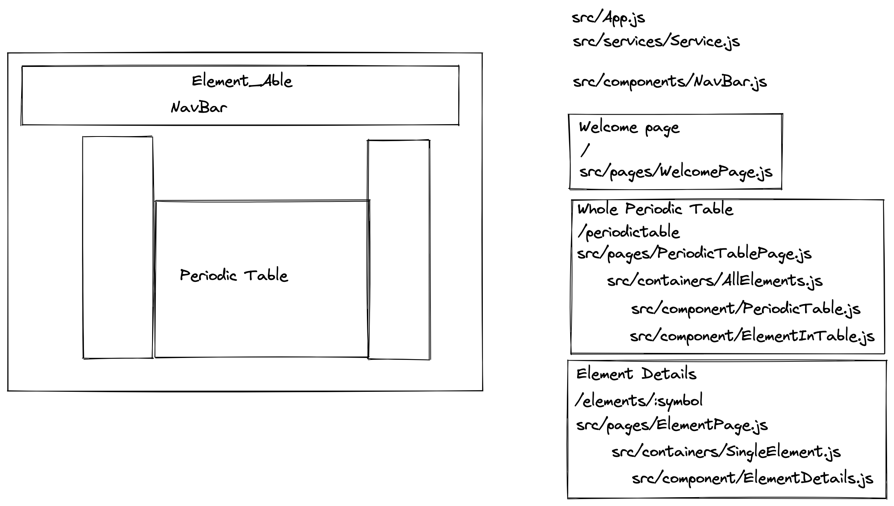

# element_able

Codeclan group project creating an educational app.  It should use the MERN stack of MonogoDB, Express, React and Node (JavaScript).

Team 'Element_Ables' is
[Richard Backhouse](https://github.com/rich-back),
[Cordu Gunst](https://github.com/Cordu7),
[Jenna Howieson](https://github.com/Jennahowieson),
[Benjamin Smith](https://github.com/bsmith).

## Demo

https://user-images.githubusercontent.com/114738026/235137535-80c6ea9e-ca52-4c69-ba7d-74f0b4886c74.mp4

## The Brief

The BBC are looking to improve their online offering of educational content by developing some interactive browser applications that display information in a fun and interesting way. Your task is to make a Minimum Viable Product that enables the user to: explore the names of the elements of the periodic table and  learn the groups of the periodic table.  Our user is a 14-16 year-old National 5 student studying Chemistry.

### MVP

A user should be able to:

* View some information about the elements of the periodic table
* Move between elements that are in the same group
* Show the whole periodic table

## Planning

